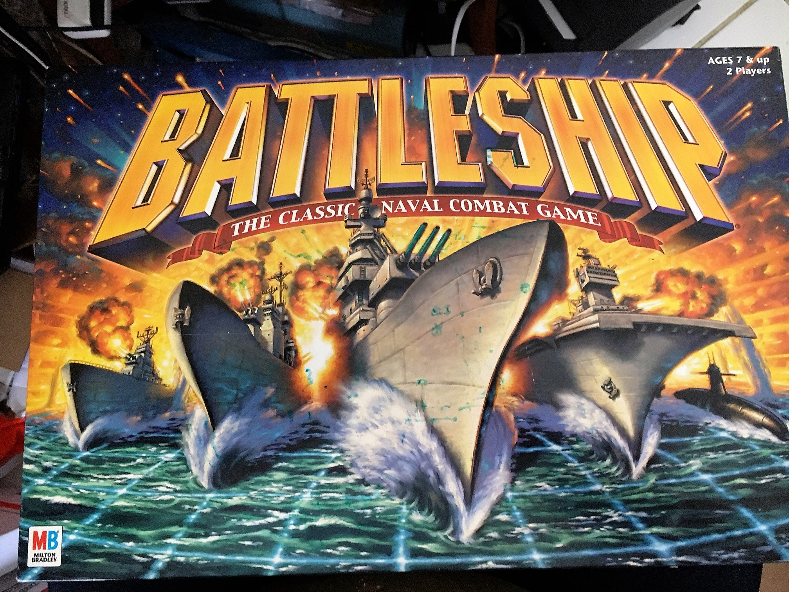
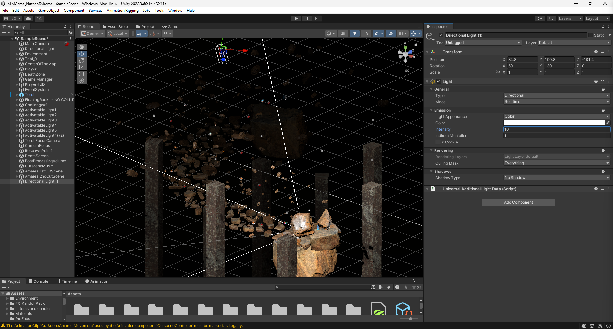

Portfolio
=========

My Programming Projects
--------------------

*For access to my private project repositories, please [email me](mailto:NKDykema@csustudent.net?subject=GitHub%20Access) with the subject line, GitHub Access.

---
### [Console Battleship in C++ | CSCI 235](project1.md)

---
### [C# Unity Game Development | CS445](project2.md)

---
### [Project 3 Title | CSCI 325](project1)

---
### [Project 4 Title | CSCI 332](project1)

---

Ethical Compositions
-------------

### [Cyberattacks and the Electronic Grid](assets/Cyberattacks_and_the_Electronic_Grid.docx)

-   **Class:**  CSCI 445
-   **Grade:**  A

### [Autonomous Vehicles and Moral Decision](assets/Autonomous_Vehicles_and_Moral_Decision.pdf)

-   **Class:** CSCI
-   **Grade:** A

### [The Ethical Implications of Artificial Intelligence in Software Developement](/assets/The_Ethical_Implications_of_Artificial_Intelligence_in_Software_Development.docx)

-   **Class:** 
-   **Grade:**

---

Presentations
-------------

### [Presentation 1 Title](/pdf/sample_presentation.pdf)

- **Class:** 
- **Grade:**

### [Presentation 2 Title](/pdf/sample_presentation.pdf)

- **Class:** 
- **Grade:**

---

Page template forked from <a href="https://github.com/csu-cs/csci-portfolio">CSU-CS</a>

<!-- Remove above link if you don't want to attributive -->
