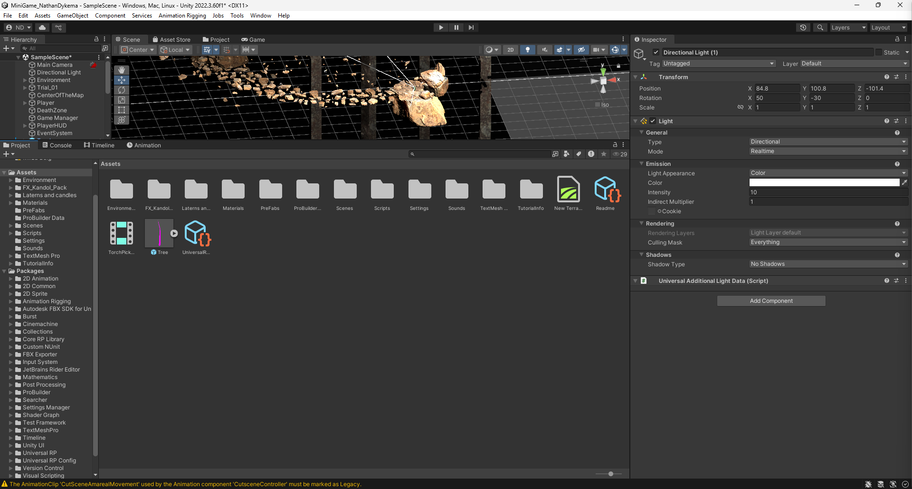
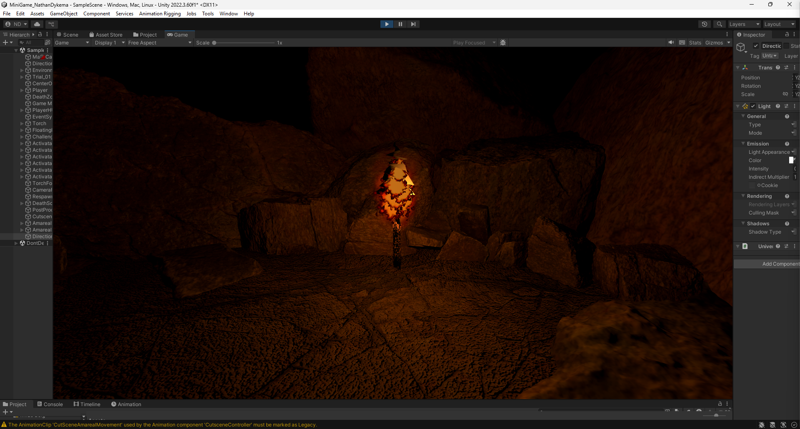
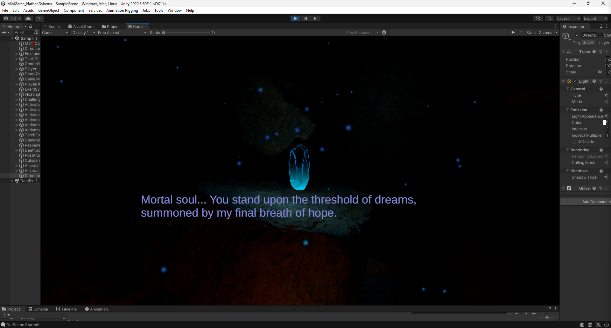
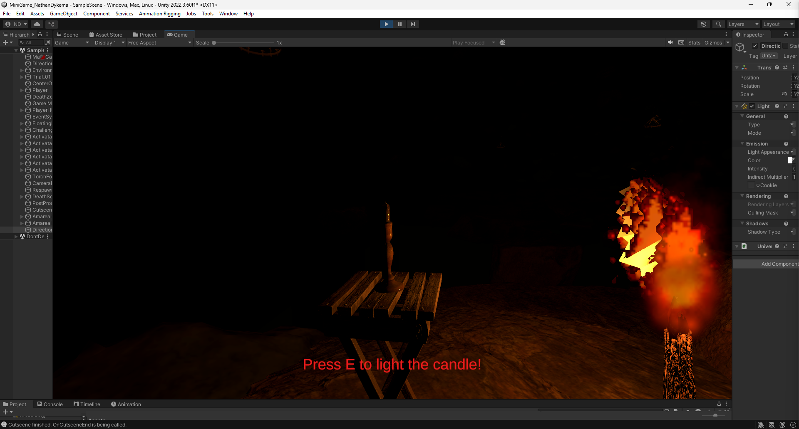
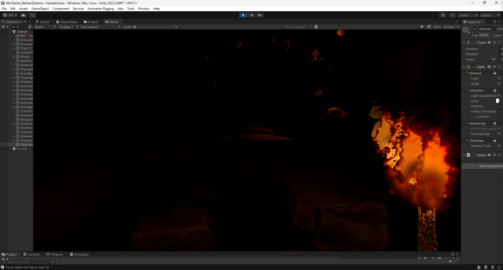
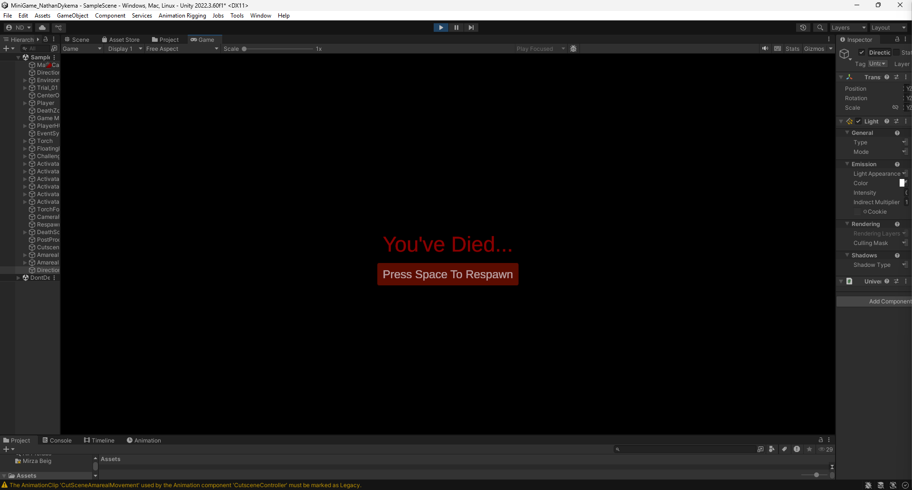

[Back to Portfolio](./)

Beneath The Shattered Sky - Video Game Development
===============

-   **Class:** CS445
-   **Grade:** A
-   **Language(s):** C# 
-   **Source Code Repository:** [Unity Video Game Development](https://github.com/ndykema/CS445-Video-Game-Development)  
    (Please [email me](mailto:example@csustudent.net?subject=GitHub%20Access) to request access.)

## Project description

This Unity Project was created as part of a semester long Video Game Development class. The initial idea was a script that I had initially written for a story-line called "Beneath the Shattered Sky". This project is a small demo that I created in Unity using C# scripts, Asset management, Texture Packs, 3D modeling software, and other Video Game Developement tools. This quick demo contains a few short cut scenes, camera panes, interactible objects, custom flame texture packs, and custom made audio tracks. The objective of this demo is to pick up the torch, interact with the Angel Amarael, and light the candelabras to shed light on the trecherous rocks the player must jump across. Watch out...the abyss below calls your name. 

## How to compile and run the program

How to compile and run the project.

In order to compile this project, the Repository must be cloned onto your local device. This is a simple process and can be done using git commands in Bash. 

```bash
git clone https://github.com/ndykema/CS445-Video-Game-Development.git
```
or you can also download the ZIP from GitHub.

You must download Unity Hub in order to open the project folder and ensure that you use the correct version of Unity to boot this project. 
The Version: 2022.3.60f1

Once the project folder is open, you can use the Play button at the top of the editor to sample it in Unity Hub, or you can build an executable file using the File > Build Settings > Select the Platform > Build. 

## UI Design

In this video game, I focused on creating an experience that draws the player in, builds emotional engagement, and encourages curiosity through exploration. The game begins in a dark, minimal environment, where the first object the player encounters is a torch. This serves both as a visual guide and an interactive introduction to the core mechanics. Using standard WASD movement and mouse controls, the player can pick up the torch, which immediately transitions into a cutscene featuring Amareal, who provides initial direction.

After the cutscene, the player is intentionally left without explicit instructions, which encourages exploration and discovery. As the player navigates the environment, they encounter a candle that can be lit using the torch. This moment establishes a gameplay pattern that continues throughout the level. The player lights objects to reveal pathways. Illuminated rocks appear, allowing the player to traverse gaps and progress forward. This loop repeats and reinforces the mechanic until the player ultimately reaches Amareal at the end of the sequence.

A significant portion of development time was dedicated to refining movement and animation. It was important to me that player actions such as walking and jumping felt responsive and realistic, with carefully tuned physics. Beyond mechanics, I prioritized creating an immersive environment that avoided feeling overly simplistic or overly stylized. This included implementing smooth cutscene camera transitions, properly timed music cues, and fluid interactions with objects.

From a technical standpoint, much of this functionality was built using C# within Unity. I designed systems with scalability in mind by applying object-oriented programming principles to structure core components such as the player, inventory, and interactive items. This approach ensures that the project can be expanded efficiently in future development.


  
Fig 1. Base load into the Unity project

  
Fig 2. Assets, Scripts, and Sample Scene

  
Fig 3. Starting Gameplay

  
Fig 4. Basic CutScene

  
Fig 5. Interactible Candles

  
Fig 5. Transversing the Rocks

  
Fig 5. Player Death

## 3. Additional Considerations

Additional considerations for this project included scalability, player guidance, and performance. The core systems were designed using object-oriented principles so that new mechanics, items, and interactions can be added without needing to rewrite existing code. I also focused on balancing guidance and exploration by introducing subtle visual cues, such as lighting, to lead the player without explicit instructions.

Performance and usability were also taken into account, especially with lighting effects and physics interactions in a dark environment. Care was taken to ensure that visual elements enhanced the experience without negatively impacting performance. Future improvements could include expanding level design, adding more complex puzzles, implementing a save system, and refining audio design to further increase immersion.

For more details see [GitHub Flavored Markdown](https://guides.github.com/features/mastering-markdown/).

[Back to Portfolio](./)
