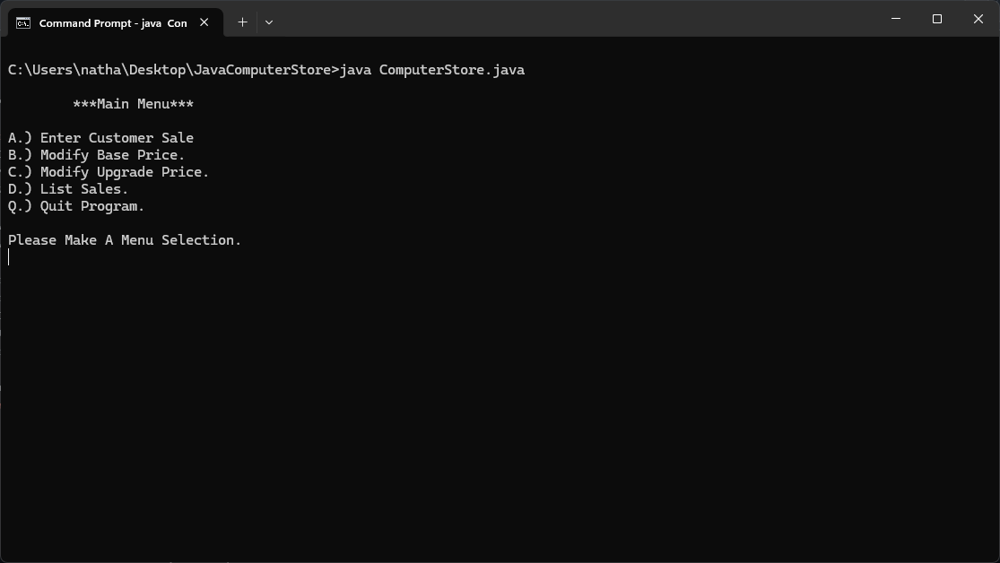
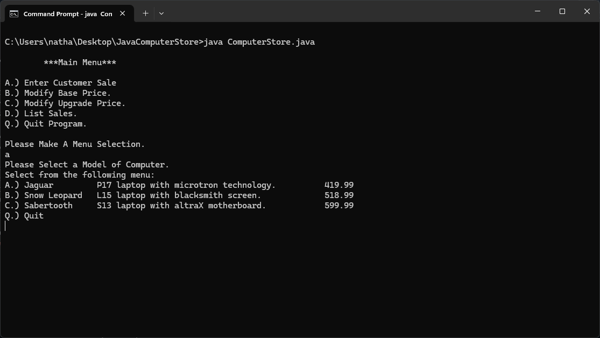
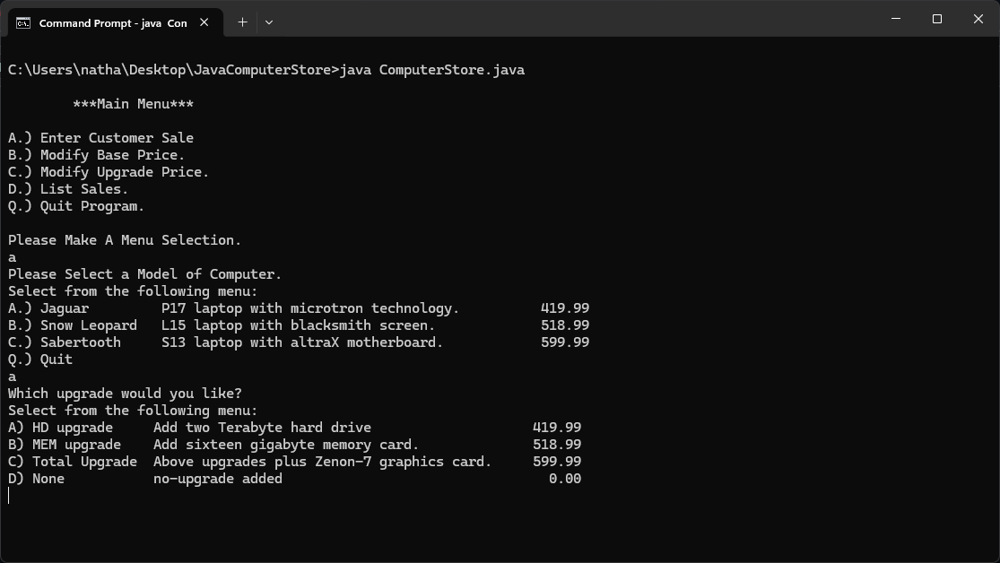
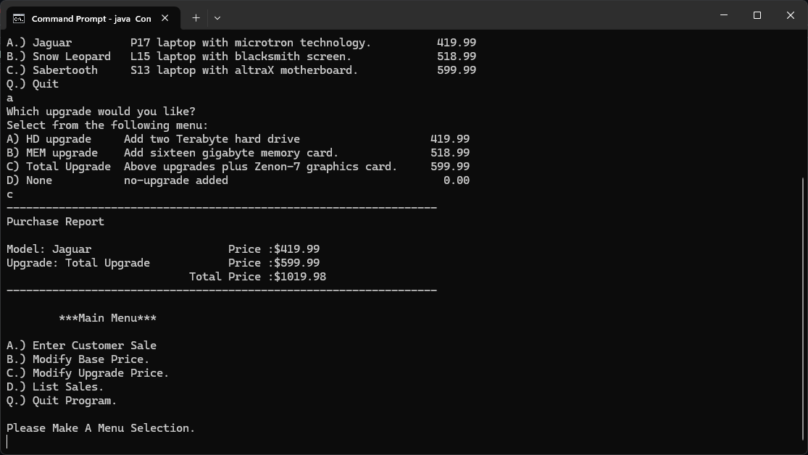
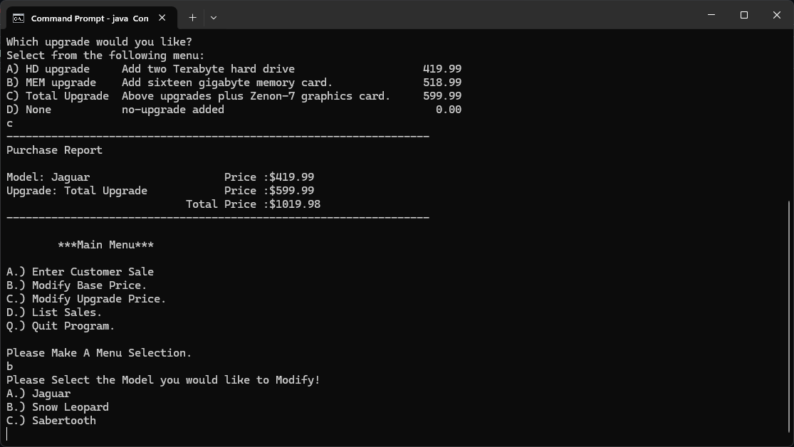
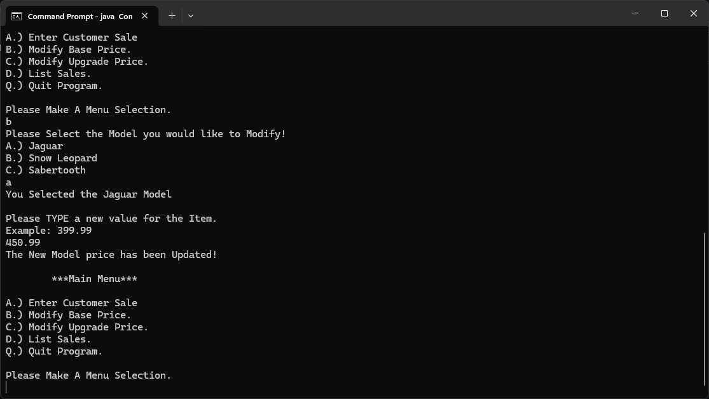
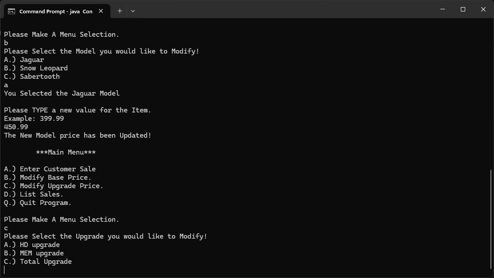
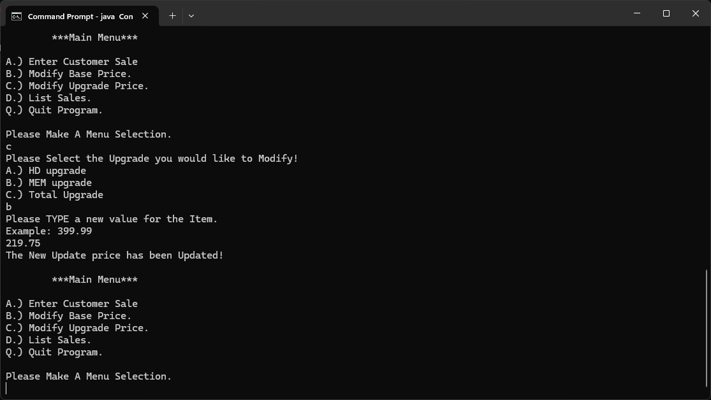
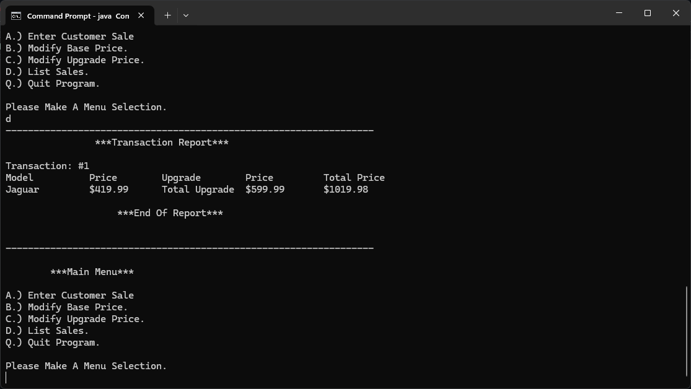
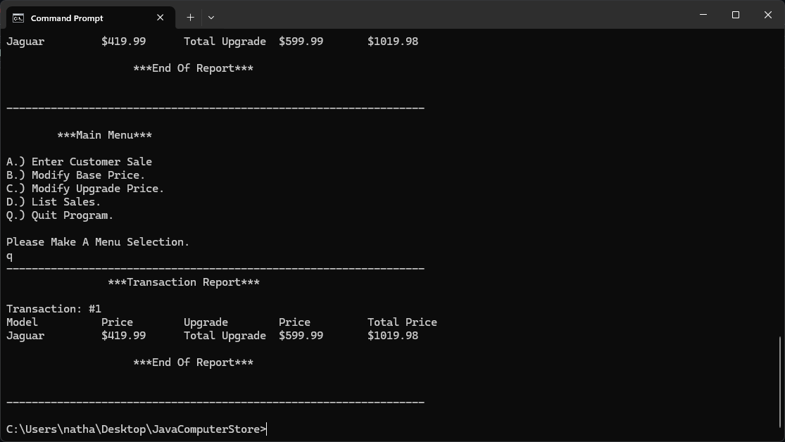

[Back to Portfolio](./)

Java OOP - Console Computer Store 
===============

-   **Class: CS187**
-   **Grade: A** 
-   **Language(s):** Java
-   **Source Code Repository:** [Java OOP Computer Store](https://github.com/ndykema/ComputerStoreProject)  
    (Please [email me](mailto:example@csustudent.net?subject=GitHub%20Access) to request access.)

## Project description

This project is a console-based computer store catalog system that allows users to browse laptop models, view detailed specifications, and apply optional upgrades to customize their purchase. The program simulates a simplified retail environment where different computer models and upgrade options are stored, displayed, and selected through user interaction.

The system organizes computer models using structured data such as arrays and objects, where each product includes a name, model number, description, and base price. Users can navigate through available models and select upgrades such as additional memory, storage, or bundled enhancements. Once a selection is made, the program calculates the total cost and presents a summary of the configured system.

In addition to product selection, the program focuses on maintaining a clean and logical structure for handling catalog data, upgrade combinations, and pricing calculations. The goal of the project is not only to simulate a store interface, but also to demonstrate how structured data and object-oriented design can be used to manage real-world systems.

## How to compile and run the program

How to compile and run the project.

In order to compile and run this program, the following are needed:

- A Java Development Kit (JDK 8 or higher)
- A Java-compatible IDE (such as Visual Studio Code, Eclipse, or IntelliJ)

All required source files should be located in the same project folder.

```bash
cd /ComputerStore
javac ComputerStore.java
java ComputerStore
```
Compilation for IDEs:

    1.) Open the project folder in your IDE
    2.) Ensure all .java files are included in the project
    3.) Build or compile the project using the IDE’s build option
    4.) Run the main class (ComputerStore.java)

## UI Design

Although this project operates in a console environment, it includes a structured and user-friendly interface that allows customers to interact with the catalog efficiently.

At launch, the user is presented with a list of available computer models along with their basic information. The interface guides the user through selecting a model and then choosing from a set of upgrade options. Each upgrade includes a description and additional cost, allowing the user to make informed decisions.

The program validates user input to ensure that selections are within valid ranges and correspond to available options. If invalid input is detected, the system prompts the user to try again, ensuring smooth interaction and preventing crashes.

After completing the selection process, the program generates a detailed summary of the chosen computer configuration, including the base model, selected upgrades, and final price. This output mimics a simplified receipt system and reinforces clarity for the user.

The interface emphasizes readability by spacing outputs clearly, labeling sections, and guiding the user step by step through the process.


  
Fig 1. Store Main Menu.

  
Fig 2. Menu Selection - Entering a Customer Sale and selecting device.

  
Fig 3. Possible Upgrades for the device selected

  
Fig 4. Purchase Report from Sale.

  
Fig 5. Menu Selection - Modify Prices

  
Fig 6. Modifying the price of an item

  
Fig 7. Menu Selection - Modify Upgrades

  
Fig 8. Changing the Price of an Upgrade

  
Fig 9. Menu Selection - List Sales

  
Fig 10. Menu Selection - Quit

## 3. Additional Considerations

One important aspect of this project involved balancing functionality with simplicity. The goal was to create a system that accurately models a real-world computer store while remaining easy to understand and navigate. This required careful organization of data structures and clear separation between product information, user input handling, and pricing logic.

This project provided hands-on experience with arrays, ArrayLists, object-oriented programming, and modular design. It also strengthened skills in managing structured data and implementing user-driven workflows in a console application. By separating concerns such as catalog management and pricing logic, the program remains maintainable and scalable for future enhancements.

Additionally, the project emphasized input validation and user guidance, which are critical in preventing errors and improving usability. These considerations helped reinforce the importance of designing software that not only works correctly but also provides a clear and intuitive experience for the user.

Because the project simulates a real purchasing system, it serves as a strong example of applying programming concepts to practical applications. It demonstrates the ability to design, structure, and implement a complete system that integrates data management, user interaction, and logical processing.

For more details see [Beneath The Shattered Sky Presentation](assets/BeneathTheShatteredSky.pptx).

[Back to Portfolio](./)
