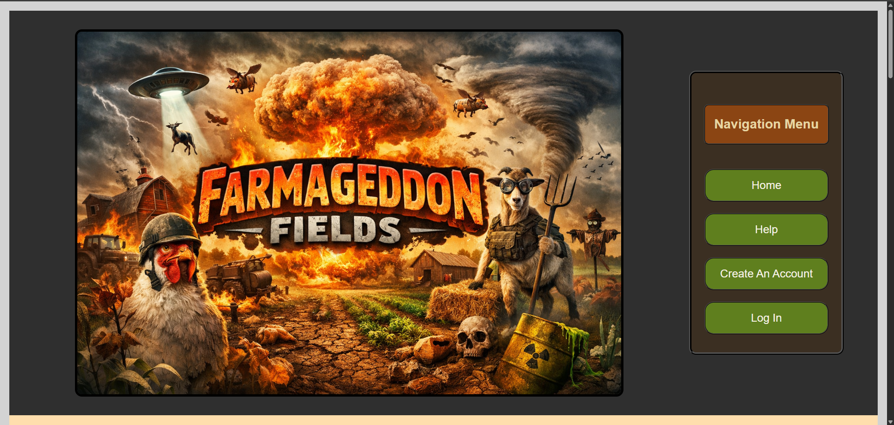
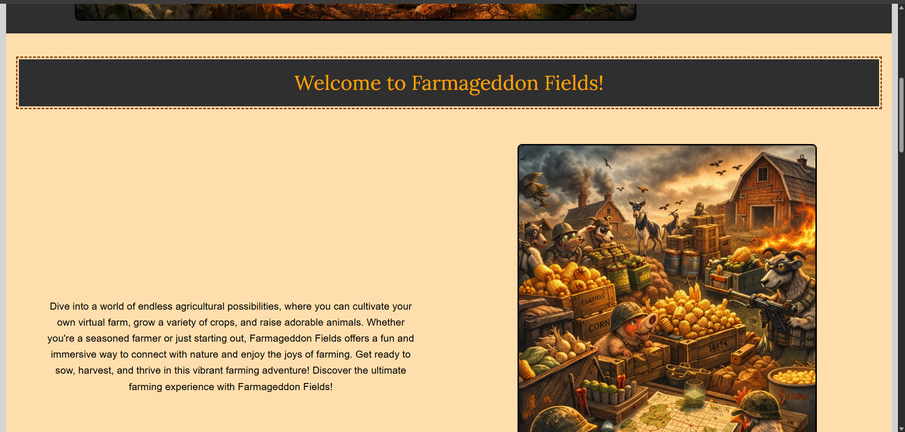
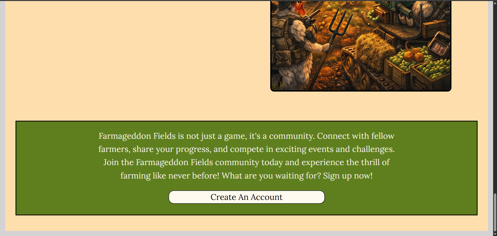
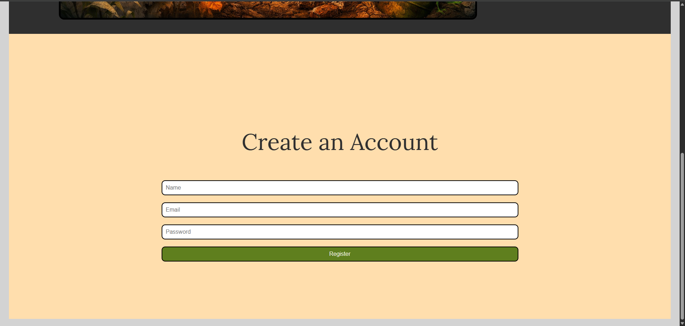
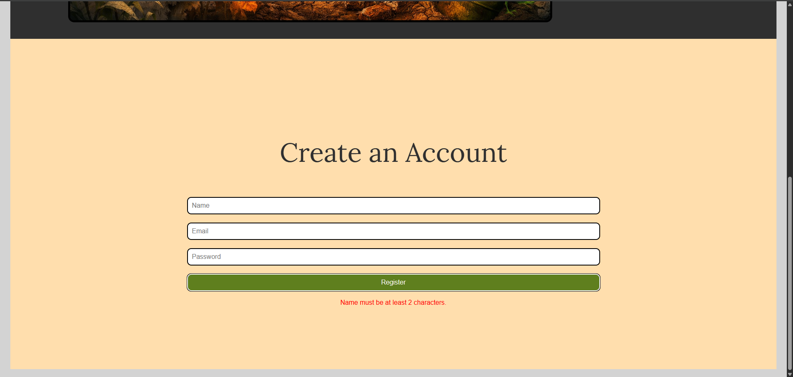
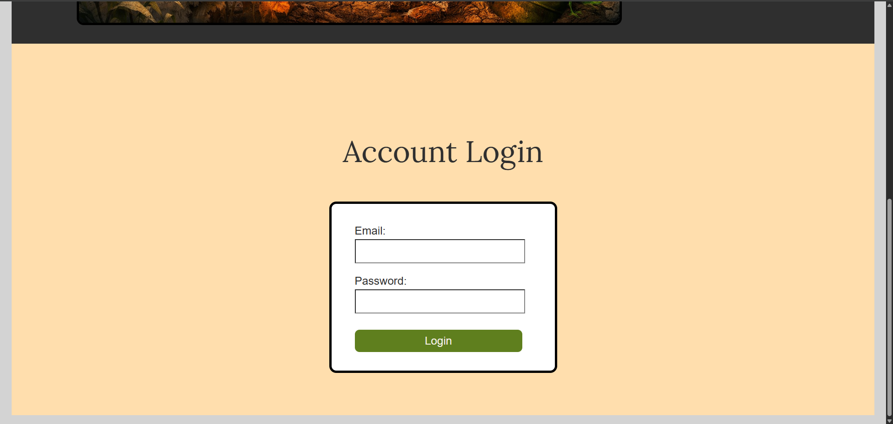
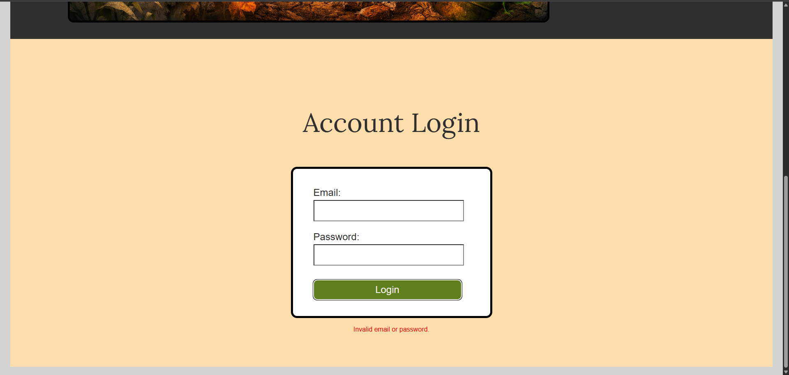
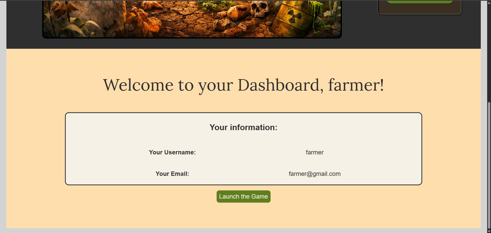
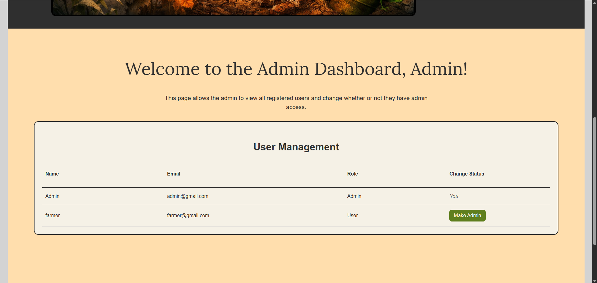
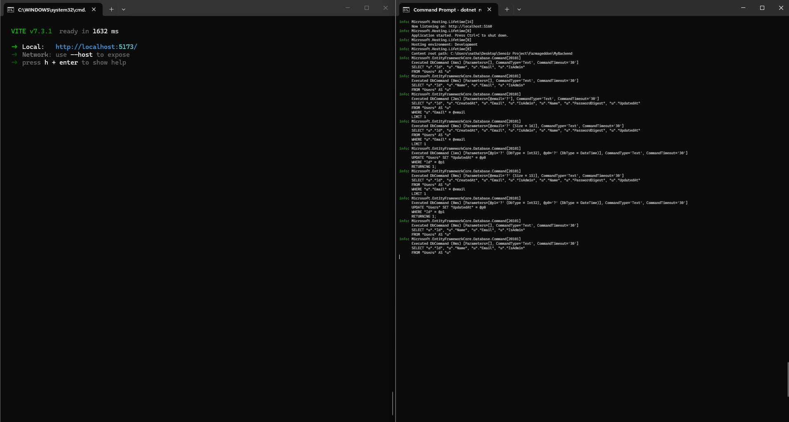

[Back to Portfolio](./)

Full Stack Application - Farmageddon App 
===============

-   **Class: CSCI 334**
-   **Grade: In-Progress** 
-   **Language(s):** JavaScript, C#, CSS, HTML
-   **Source Code Repository:** [Full Stack Application Project](https://github.com/ndykema/Farmageddon)  
    (Please [email me](mailto:example@csustudent.net?subject=GitHub%20Access) to request access.)

## Project description

This project is a console-based computer store catalog system that allows users to browse laptop models, view detailed specifications, and apply optional upgrades to customize their purchase. The program simulates a simplified retail environment where different computer models and upgrade options are stored, displayed, and selected through user interaction.

The system organizes computer models using structured data such as arrays and objects, where each product includes a name, model number, description, and base price. Users can navigate through available models and select upgrades such as additional memory, storage, or bundled enhancements. Once a selection is made, the program calculates the total cost and presents a summary of the configured system.

In addition to product selection, the program focuses on maintaining a clean and logical structure for handling catalog data, upgrade combinations, and pricing calculations. The goal of the project is not only to simulate a store interface, but also to demonstrate how structured data and object-oriented design can be used to manage real-world systems.

## How to compile and run the program

In order to compile and run this program, the following are needed:

 - Node.js (for React frontend)
 - .NET SDK (for backend)
 - Visual Studio Code or Visual Studio

Download the Zip file and unzip in the desired location.

Once this is done, open CMD and follow the Back end and Front end Instructions.

### Running the Backend
```bash
cd /Farmageddon/MyBackend
dotnet run
```
The back end will run at:
```bash
http://localhost:5160
```

### Running the Frontend
Open a seperate CMD terminal.
```bash
cd /Farmageddon/MyFrontEnd
npm install
npm run dev
```
The front end will run at:
```bash
http://localhost:5173
```

## UI Design

The user interface is designed to be simple, structured, and responsive while demonstrating core frontend concepts.

Upon entering the application, users are greeted with a homepage that introduces the Farmageddon Fields concept through descriptive sections and images. Navigation is handled through a persistent banner menu that dynamically updates based on login status.

Users can create an account through a form with input validation, ensuring proper data entry before submission. Once registered, users can log in and are redirected based on their role. Standard users are taken to a personal dashboard where their account information is displayed clearly in a structured layout.

Administrative users are directed to an admin dashboard, which provides a more functional interface. This dashboard displays all registered users in a table-like format and allows the admin to promote or demote users using interactive buttons. This demonstrates real-time updates and backend communication.

The application uses conditional rendering extensively to ensure that only appropriate navigation options and pages are visible based on authentication and role. Feedback messages are displayed to inform users of successful actions or errors, improving usability and clarity.

Overall, the interface emphasizes readability, structured layout, and clear interaction flow while maintaining a clean visual design.


  
Fig 1. Web Application Main Menu.

  
Fig 2. Website Content

  
Fig 3. Homepage Create Account Prompt

  
Fig 4. Create Account Page

  
Fig 5. Create Account Error Handling

  
Fig 6. Login Page

  
Fig 7. Login Error Handling

  
Fig 8. User Dashboard after Login

  
Fig 9. Admin Dashboard after Login

  
Fig 10. Front End and Back End running in Command Prompt

## 3. Additional Considerations

One of the primary challenges of this project was integrating frontend and backend systems while maintaining clear separation of responsibilities. The frontend focuses on user interaction and display, while the backend manages data storage, validation, and authentication logic.

Another important consideration was implementing role-based access control. This required careful handling of user data, ensuring that admin privileges were properly assigned and respected throughout the application. The system automatically assigns admin status based on specific conditions during registration, which simplifies testing while demonstrating role differentiation.

Security was also a key focus. Passwords are never stored in plain text and are instead hashed using ASP.NET Identity tools. Additionally, login responses are structured to avoid exposing sensitive information.

The project also demonstrates the use of local storage for maintaining user sessions, allowing the application to persist login state across page refreshes. This improves user experience while showcasing client-side state management.

From a design perspective, the application emphasizes modular structure, with separate components handling different parts of the interface. This improves readability, maintainability, and scalability for future development.

Overall, this project highlights the ability to build a complete full-stack application, integrating modern frontend frameworks with backend APIs, database management, and user authentication systems. It demonstrates practical application of software development concepts in a real-world scenario.

[Back to Portfolio](./)

